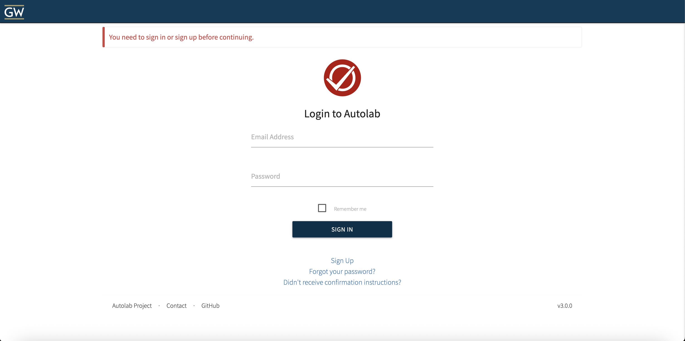
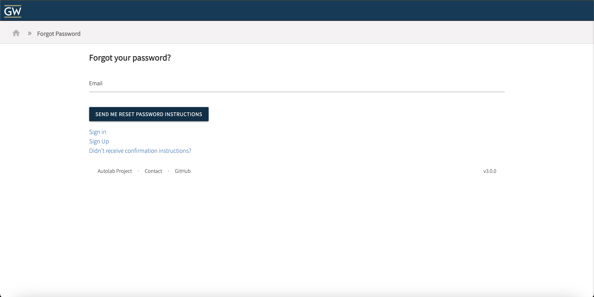
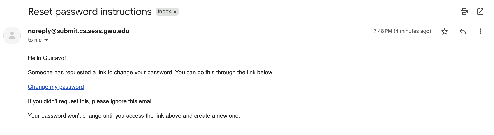
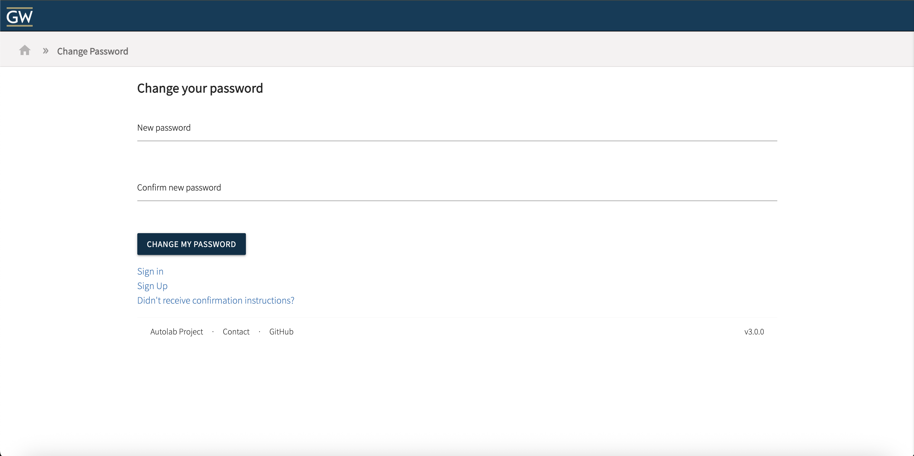
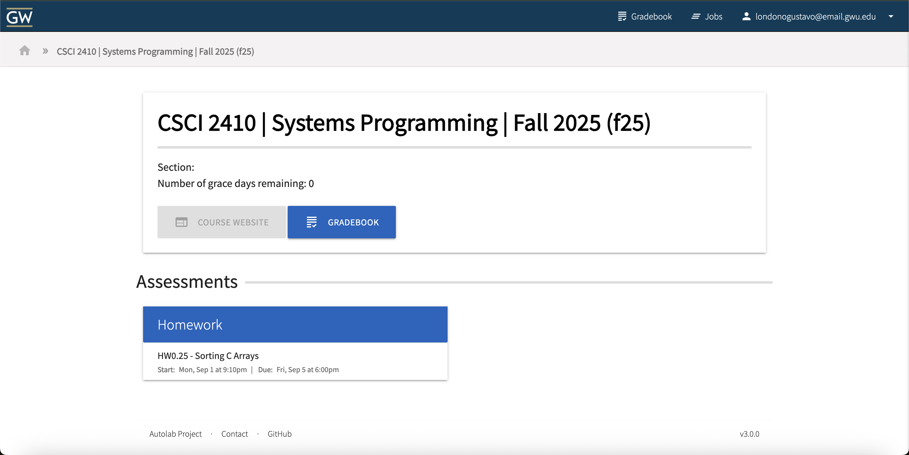

# Submission Server Tutorial
A tutorial to guide students through setting up their accounts with the submission server for CSCI2410 and learning how to submit a homework.


## Step 1: Go to the submit server webpage
Navigate to the submit server [webpage](https://submit.cs.seas.gwu.edu/)

## Step 2: Credentials
> **NOTE**: You **must** use your @gwu.edu email.



### When presented with the login: </n>
1. Click ```Forgot your password?```


2. Enter GW Email

3. Click ```Send Me Reset Password Instructions```

4. Wait around 5 minutes for the email to reach your inbox (Don't click mulitple times)



5. Change your password


6. Go back to the login page (click the house icon in the top left)


7. Sign in using your email and the password you just set
