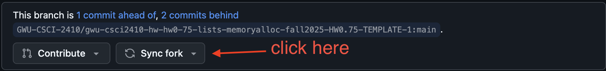
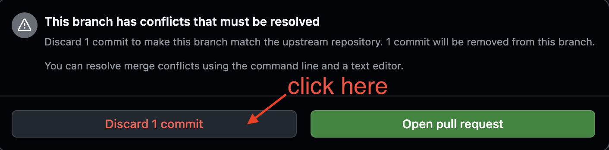
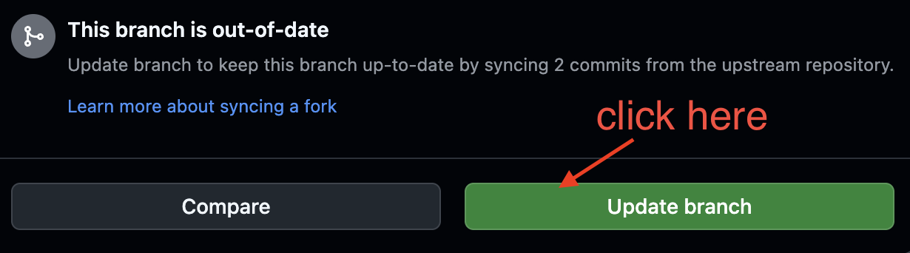

# Avoiding merge conflicts

Follow these instructions carefully to avoid merge conflicts on your HW0.75

1. Create a backup of you current work. You can do it by either manually copying the files locally or running the following commands on the submit server. This step is important so check carefully if your backup was correctly created. Do this to avoid losing your work. If you have confusions, please contact us before proceeding with the next steps. 

2. Go to your repository's github, and click on `Sync Fork`

3. You should see either #option1 or #option2

**For #option1**

If you see #option1 - it means you had made a recent push to your github that is causing this conflict. Click on `Discard commit` as shown below. 

**For #option2**

If you see #option2 - it means there are no merge conflicts. Click on `Update branch`

4. Clone your repository to a different location, this will likely not have the changes you had pushed/made so you need to manually replace the files from the backup to this new clone. Make all future changes and commits from the new clone. 
