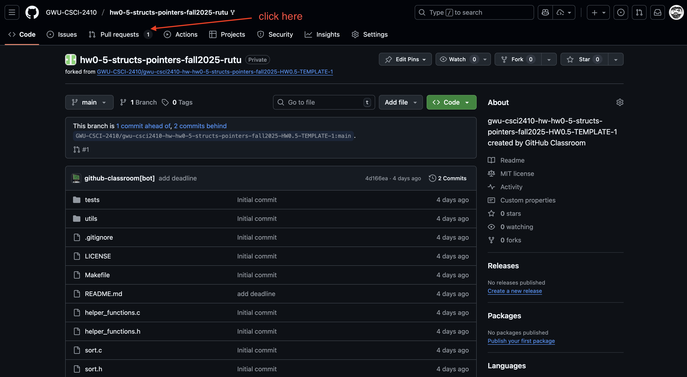
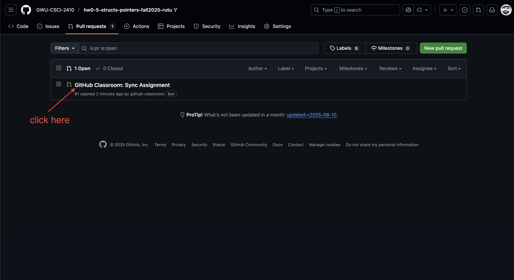
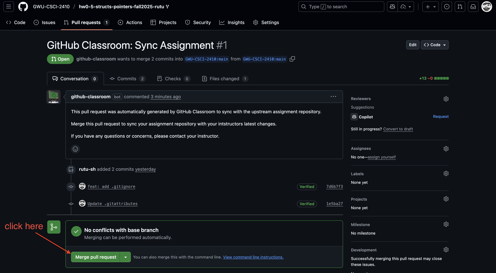
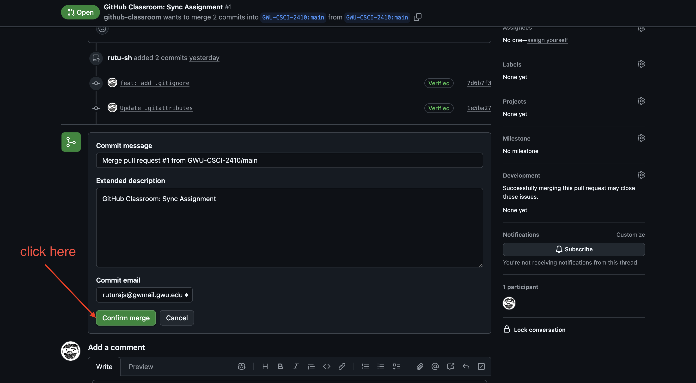

# Merge Pull Request 

Follow these steps to merge the Pull Request created by Github Classroom. 

1. Head to your repository. 

2. Click on the `Pull Requests` tab 



3. Click on the most Pull Request created by Github Classroom. 



4. Click on `Merge pull request`



5. Click on `Confirm merge`



6. Run a `git pull` wherever you were working with your assignment code.  

```shell
git pull
```

