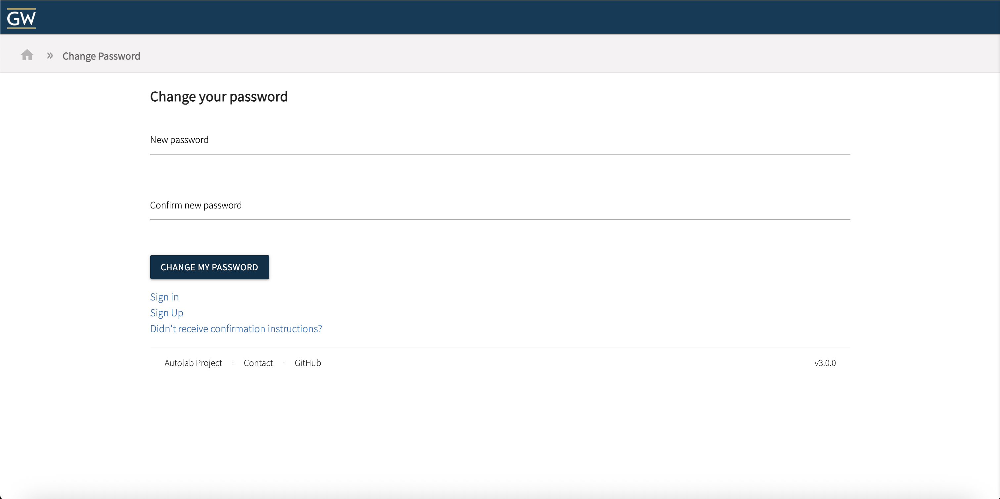
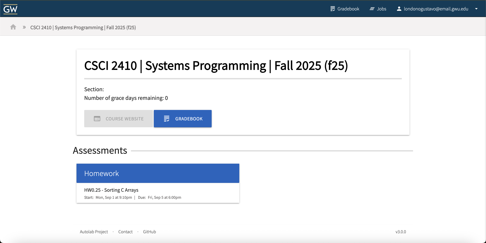

# Submission Server Tutorial
A tutorial to guide students through setting up their accounts with the submission server for CSCI2410 and learning how to submit a homework.


## Step 1: Go to the submit server webpage
Navigate to the submit server [webpage](https://submit.cs.seas.gwu.edu/)
## Step 2: Credentials
> **NOTE**: The email you enter *must* be the same email placed in the submission form from the beginning of the semester (i.e. gwmail.gwu or gwu.edu)


### When presented with the login: </n>
1. Click ```Forgot your password?```

2. Enter GW Email
3. Click ```Send me Reset Password Instructions```
4. Wait around 5 minutes for the email to reach your inbox

5. Change your password

6. Go back to the login page (click the house icon in the top left)

7. Sign in using your email and the password you just set 

## Step 3: Submitting Homeworks/Assessments

### Here you will find all of the Homeworks/Assessments.
1. Click on the homework/assessment you would like to submit material for

2. In your terminal (make sure you are in the correct directory), run:
```bash
make tar
```
3. Go back to the submit website, drag and drop the submission.tgz file into the submission area.
4. Read the checkbox conditions and proceed
5. Click ```Submit```
