# Submission Server Tutorial
A tutorial to guide students through setting up their accounts with the submission server for CSCI2410 and learning how to submit a homework.


## Step 1: Go to the submit server webpage
Navigate to the submit server [webpage](https://submit.cs.seas.gwu.edu/)

## Step 2: Credentials
> **NOTE**: The email you enter *must* be the same email placed in the submission form from the beginning of the semester (i.e. gwmail.gwu or gwu.edu)


### When presented with the login: </n>
1. Click ```Forgot your password?```


2. Enter GW Email

3. Click ```Send Me Reset Password Instructions```

4. Wait around 5 minutes for the email to reach your inbox

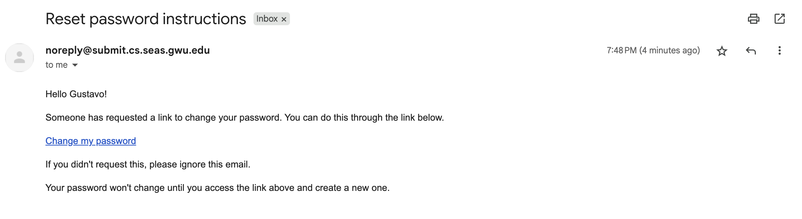

5. Change your password


6. Go back to the login page (click the house icon in the top left)


7. Sign in using your email and the password you just set 

## Step 3: Submitting Homeworks/Assessments


### Here you will find all of the Homeworks/Assessments.

# Making a submission

This section presents instructions for creating a submission for grading on Autolab, the grading server for CSCI 2410. 

1. [Submitting Assignments](#submitting-assignments)
<!-- 2. [Submitting Testing assessment](#submitting-testing-assessment) -->


## submitting-assignments

Follow these instructions to create a grading submission on Autolab. 

#### Step-1: Create GitHub release

1. Push your code to GitHub. 
2. Visit your repository on GitHub. 
3. Click on the on **Releases**

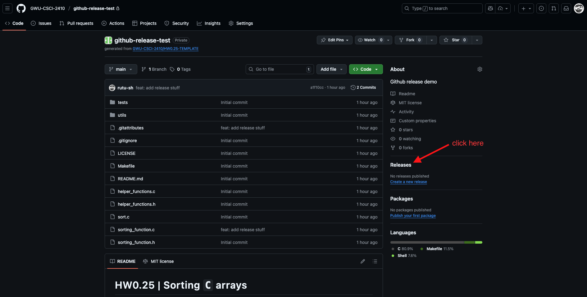

4. Click on **Create new release** or if you have existing releases, click on **Draft new release**

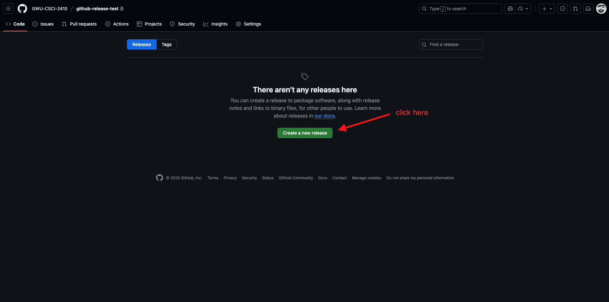

5. Create a tag for your submission as shown below. Name the tag with a unique name so that you can distinguish between submissions. 

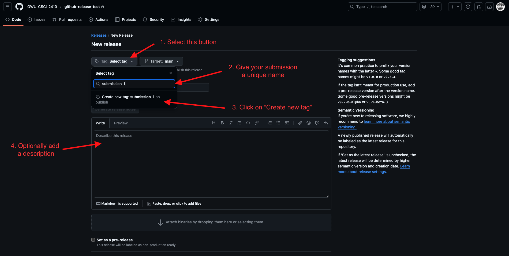

6. Give your release a name and publish the release.

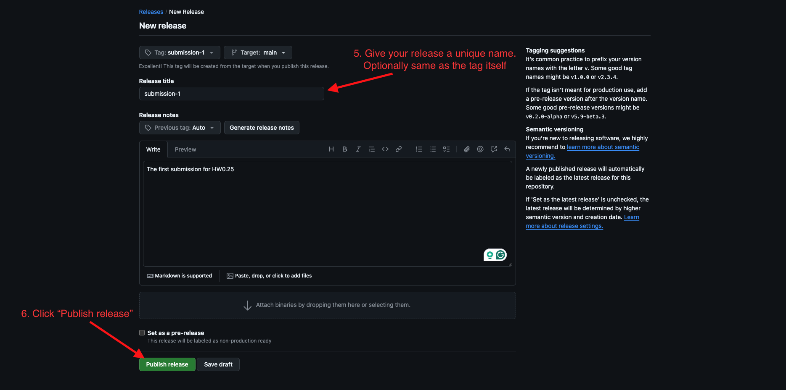

7. Download the release file by heading to the **Releases** section and under the release you want to submit, click on **Source code (tar.gz)**. This downloads a file named `<your-release-name>.tar.gz`.

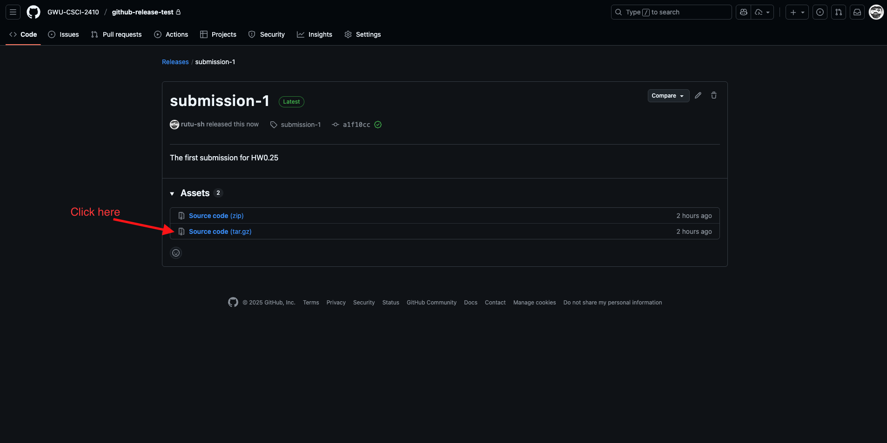

#### Step-2: Submit assessment 

1. Head to the [submit server](https://submit.cs.seas.gwu.edu/courses/csci2410_f25/assessments)
2. Select the assessment you want to grade a submission for. 

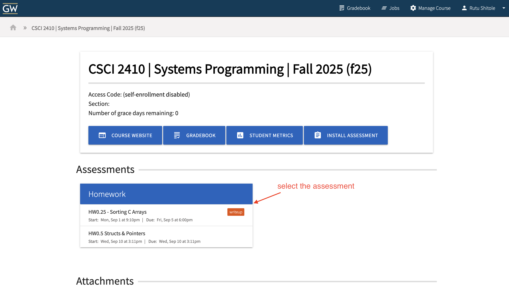

3. In the Assessment section, upload the `.tar.gz` file you just downloaded and hit `Submit`. 

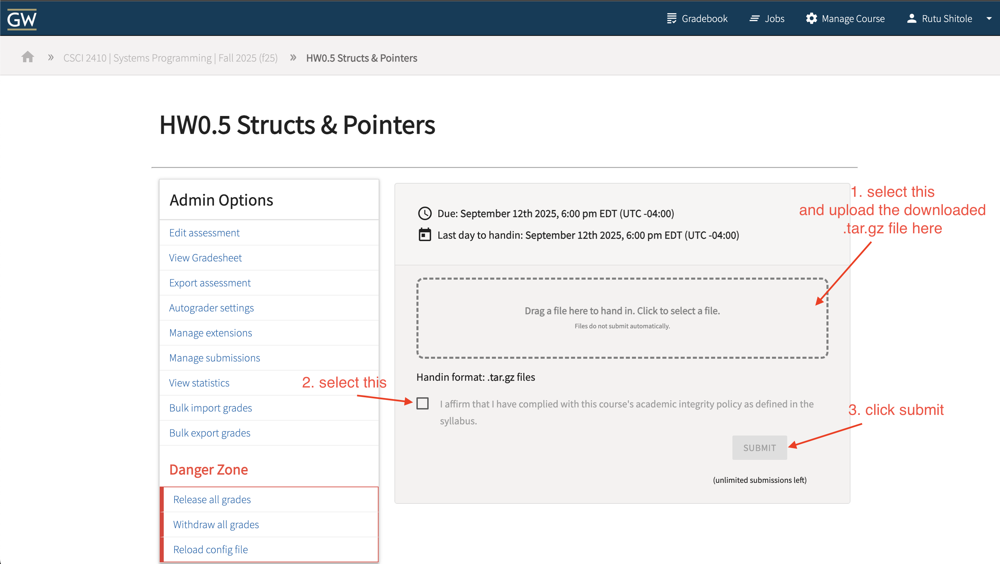

4. Head to back to the Assessment page and scroll down to see the submissions. You can see the grade for your recently submitted assignments. 

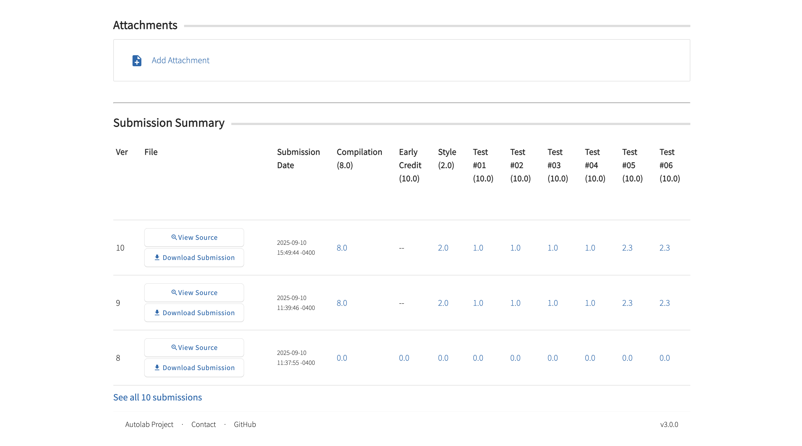

5. To know more details about the grades select **View Source**

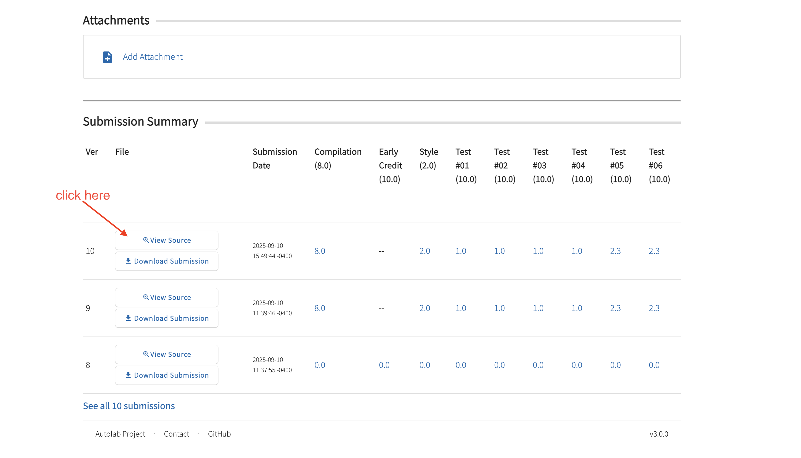

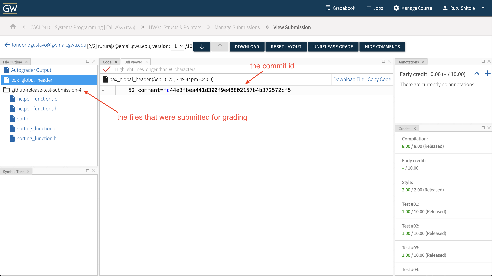


