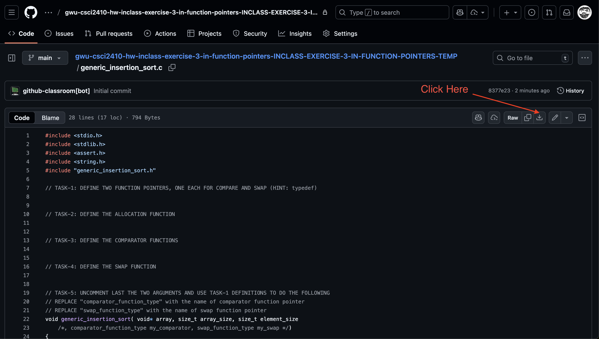

# Inclass Exercise 02 - Submissions

1. Commit and Push your code to Github. If you have not done so already, execute the following commands. 

```shell
git add -A
```

```shell
git commit -m "Final Commit"
```

```shell
git push
```

2. In your browser, head to your inclass exercise github repository and click on the `generic_insertion_sort.c` file. 


3. Click on the download icon. 



4. Head to the [submit server](https://submit.cs.seas.gwu.edu/courses/csci2410f25/assessments) and login with your `@gwu.edu` email. 

5. Click on the `Inclass Exercise - 02`


6. Upload the downloaded `generic_insertion_sort.c` file and submit. 
